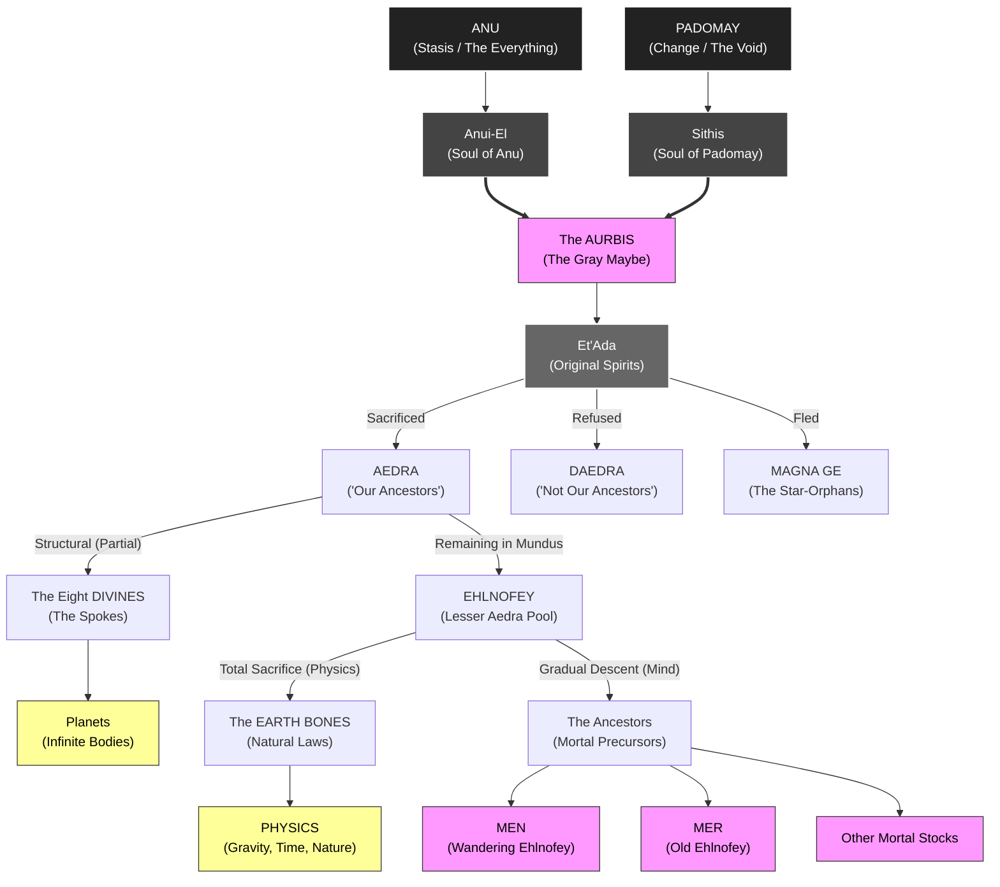

# Deity Specification & Hierarchy Table

This table categorizes the spirits of the Aurbis based on their level of sacrifice, current agency, and metaphysical role in maintaining the Mundus.

| Entity Class | Category | Sub-gradient | Sacrifice Nature | Current Status |
| :--- | :--- | :--- | :--- | :--- |
| **Primal Forces** | Anu / Padomay | 0 (Source) | None | Non-sentient cosmic constants. |
| **The Souls** | Anui-El / Sithis | 1 | None | The "Wills" of the Primal Forces. |
| **The Et'Ada** | Original Spirits | 2 | Variable | The collective pool of all gods. |
| **Daedra** | Princes / Lords | 2 | **None** | Sovereign; active in Oblivion. |
| **Magna Ge** | Star-Orphans | 2 | **Aborted** | Distant; reside in Aetherius. |
| **The Divines** | Greater Aedra | 3 | **Partial** | Comatose; The **Eight Spokes** (Planets). |
| **Ehlnofey** | Lesser Aedra | 3 | **Residual** | The starting "pool" of spirits on Nirn. |
| **Earth Bones** | Natural Laws | 4 (from Ehlnofey) | **Total** | Non-sentient; **The Laws of Physics**. |
| **Mortals** | Men / Mer | 4 (from Ehlnofey) | **Biological** | Sentient; The **Ancestors** of Nirn. |

---

## Glossary of Hierarchy Terms

* **Sub-gradient:** The "distance" from the original source. Each step down (from [[Et'Ada]] to Mortal) involves a loss of power but a gain in defined, stable identity.
* **Structural (The Divines):** These spirits gave just enough of themselves to build the "[[Aurbis|Wheel]]," but kept their minds and names.
* **Foundational (Earth Bones):** These spirits gave everything. They are the gravity that holds your players to the ground and the air they breathe.
* **Biological (Mortals):** These spirits chose to shrink in power so they could keep their individuality. They didn't become the "Laws," they became the "Inhabitants."
* 